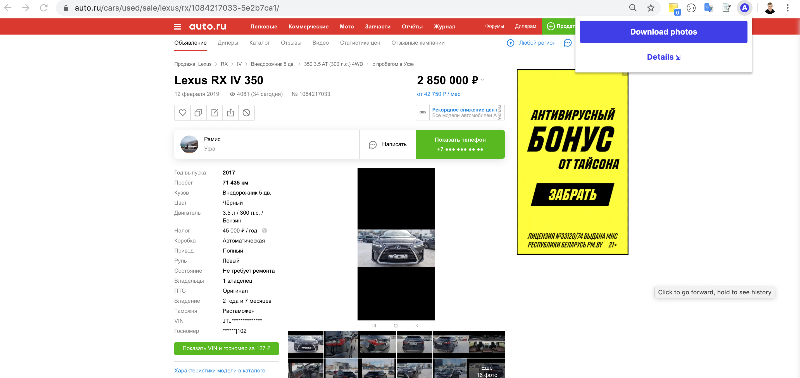

The plugin collect full size car photos from https://auto.ru and save them as zip archive to the File System.



**Due to Chrome CORS Policy you should run chrome in --disable-web-security mode**

```open -n -a /Applications/Google\ Chrome.app/Contents/MacOS/Google\ Chrome --args --user-data-dir="/tmp/chrome_dev_test" --disable-web-security```

